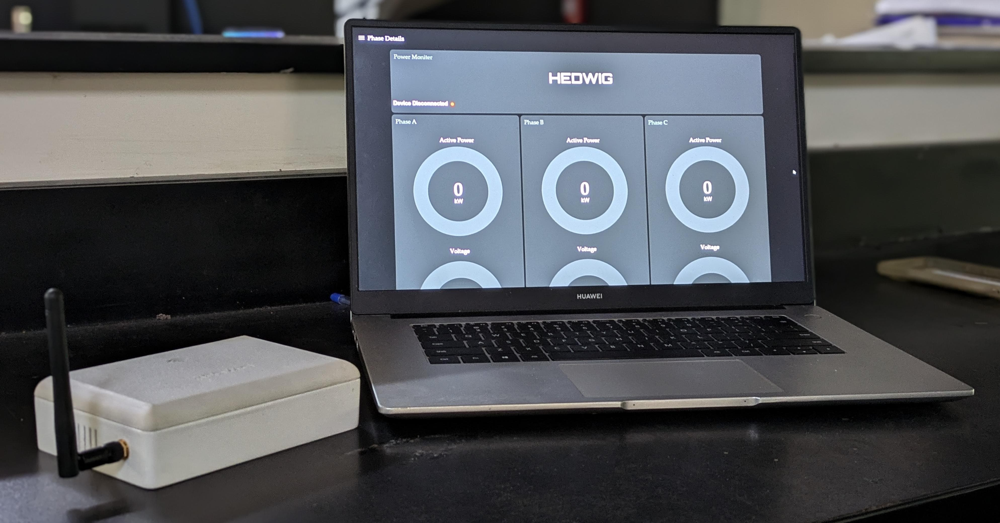

# Hedwig- IoT Power Monitoring System

## Project Overview

### Project Idea

Energy efficiency is crucial for industrial facilities to manage operating costs and reduce en-vironmental impact. While many machines have their own power monitoring systems, thescattered nature of this data makes it difficult to analyze effectively. Our project proposes anindustrial energy monitoring system to address this issue, centralizing and analyzing energydata for deeper insights. By providing real-time data transmission to a centralized system, oursolution aims to offer valuable insights into energy consumption patterns and the performanceof industrial equipment. This, in turn, empowers facilities to optimize energy usage, reducewaste, and improve overall operational efficiency.

### System Overview

The Industrial Power Monitoring System is designed to provide comprehensive monitoringand analysis of power parameters in industrial settings. The system comprises several keycomponents: voltage and current sensors, power measuring IC, microcontroller, and a cloud-based data management and visualization interface.

### PCB and Enclosure

Throughout the design process of the Industrial Power Monitoring System, we focused on cre-ating a reliable and efficient solution tailored for industrial applications. Key outcomes includethe successful integration of sensors, data processing capabilities, and robust communicationchannels for real-time data transmission and analysis. Our modular approach ensures scalabil-ity and adaptability to diverse industrial environments, facilitating seamless deployment andoperation.Looking ahead, potential enhancements could further refine the system’s performance andcapabilities. Future improvements may include enhancing sensor accuracy, expanding dataanalytics capabilities for deeper insights, and integrating predictive maintenance features tooptimize operational efficiency. Continuous iteration based on user feedback and technologi-cal advancements will be crucial to staying at the forefront of industrial energy managementsolutions.

**Collaborators:**

* [Kumal Hewagamage](https://github.com/KumalHewagamage)
* [Dulmin Edirisinghe ](https://github.com/DulminEdirisinghe)
* [Mihiran Wickramarathne](https://github.com/miniMagic-beep)
* [Nimshi Wanniarachchi](https://github.com/NimsW20)

